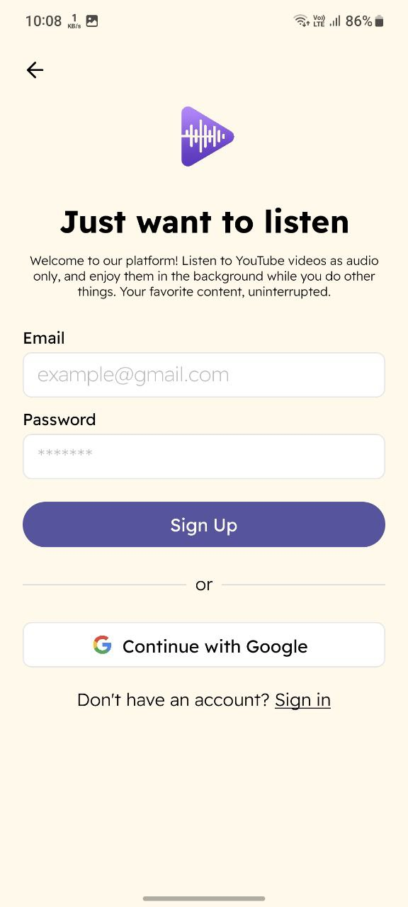
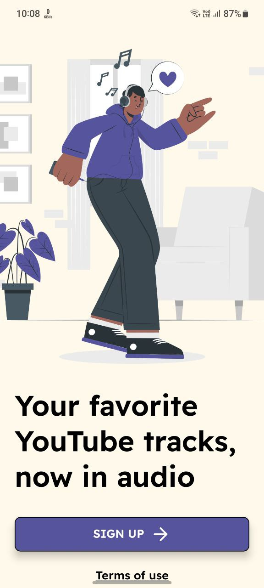
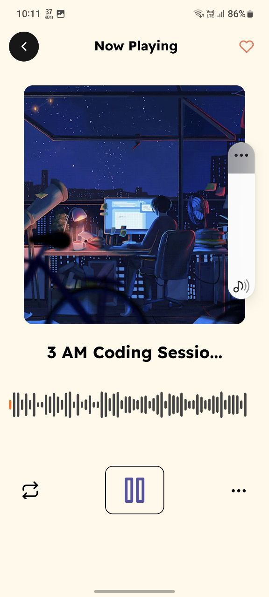
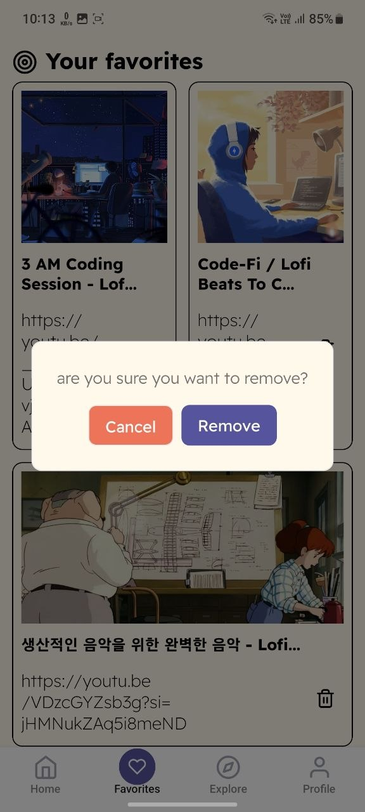

# 🎧 Studio — YouTube Audio Player for Devs

> A minimal YouTube audio player built for developers who code with lo-fi in the background.

If you're like me, you listen to YouTube while coding.

Some of us:
- Keep 10 browser tabs open  
- Play music from our phones  
- Fight YouTube’s background restrictions  
- Lose focus when the browser crashes  

So I built **Studio**.

A **React Native app** that plays YouTube audio cleanly in the background while you code.

## 📸 Preview

<p align="center">
  
  
  
  
  
</p>

<p align="center">
  <video width="500" controls>
    <source src="./assets/demo.mp4" type="video/mp4">
    Your browser does not support the video tag.
  </video>
</p>

---

## ✨ Features

- 🎵 Play YouTube audio in background
- 📱 Mobile-first experience
- ⚡ Lightweight & minimal UI
- 🔁 Stream extraction powered by `yt-dlp`
- 🧠 Built for developers who just want focus music

---

## 🏗 Tech Stack

### App
- React Native
- Expo
- Axios

### API
- Node.js
- Express
- yt-dlp

---

## 🧩 How It Works

1. The app sends a YouTube URL to the backend.
2. The backend uses `yt-dlp` to extract the audio stream.
3. The API returns a playable audio URL.
4. The app streams the audio in the background.

Simple. Clean. Dev-focused.

---

## ⚠️ Deployment Note

When deployed publicly, YouTube started blocking the API with:

> "Bot detected"

Since I’m not using expensive rotating proxies, the project is currently **local-first**.

It works perfectly when:
- Running the API locally
- Testing on local network
- Personal development use

This is a limitation of scraping-based streaming — not a bug in the app itself.

Dev life 😅

---

## 🚀 Run It Locally

### 1️⃣ Clone the App

```bash
git clone https://github.com/Natnsis/Studio
cd Studio
npm install
npm start

```bash
git clone https://github.com/Natnsis/studio-api
cd studio-api
npm install

---

## 📦 Repositories

- 🎧 App: https://github.com/Natnsis/Studio  
- 🔌 API: https://github.com/Natnsis/studio-api  

---

## 🤝 Contributing

If you find it useful:

- ⭐ Star the repo  
- 🛠 Open an issue  
- 🔁 Submit a PR  
- 💡 Suggest improvements  

---

## 🧠 Why I Built This

Because devs deserve:

- Clean focus  
- No tab chaos  
- No background restrictions  
- Just code + music  

---

## 🐛 Built by

[@Natnsis](https://github.com/Natnsis)
